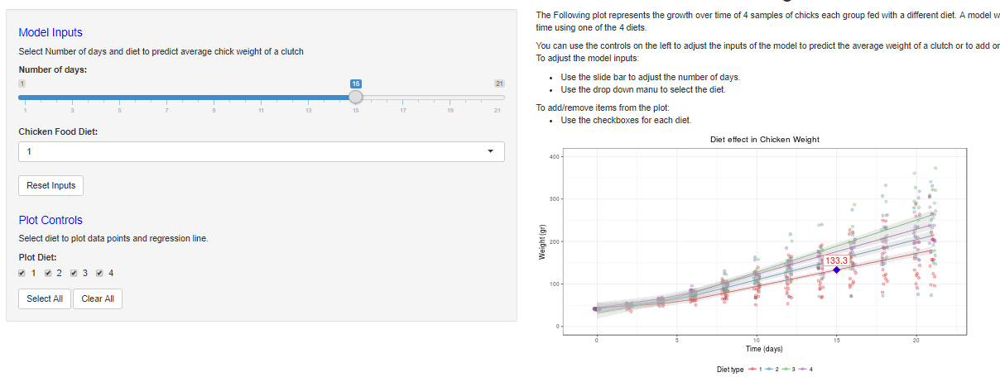

```{r setup, include=FALSE}
knitr::opts_chunk$set(echo = FALSE)
```

## Analysis Summary {.smaller}

This is a quick and dirty analysis that uses the ChickWeigth dataset from R base package to 
predict the Avg. weight of a brood using two input variables, "Time (in days)" and "Diet".

The ChickWeight dataset includes the weight of 50 chicks, each one fed with 1 of 4 different diets and weighted at different times within a range of 0 to 21 days. 

Given a new Time in days and a diet, the model will predict the avg. weight of the brood after the number of days specified. 


## Notes and Considerations {.smaller}

- This analysis is merely for demonstration purposes and might not be suitable to be used in a real world scenario.
- Residual Analysis shows that there's heteroscedasticity in the data so the model is not reliable  to predict the exact weight of chick. However, it might still be good enough to predict the average weight of the brood given a specific diet.  

```{r, fig.width=7, fig.height=3, fig.align='center'}
library(ggplot2)
CWdata<-ChickWeight

##Split Linear regression at Time=5.
CWdata$Timesp<-ifelse(CWdata$Time-5>0, CWdata$Time-5,0)
    
##Create model where weight is a function of the interaction between Time and Diet
mdl1<-lm(weight~Timesp+Time*Diet, data=CWdata)
CWdata<-cbind(CWdata, predict(mdl1, interval = 'confidence'))
CWdata<-cbind(CWdata, res=mdl1$residuals)
g<-ggplot(CWdata, aes(fit, res))+
  geom_point()+
  stat_smooth(method="loess")+
  geom_hline(yintercept=0, col="red", linetype="dashed")+
  theme_bw()+
  labs(title="Fitted vs Residuals",
       x="Fitted values",
       y="Residuals")
g
```

## Using the model {.smaller}
You can find the ChickWeight model to predict the average weight of a brood at this site: <https://elinares.shinyapps.io/chickweight/>.

Use the controls on the left-side panel to provide inputs to the model and to add or remove datapoints from the plot on the right-side panel.




## Controls {.smaller}
The application has 3 main controls, 2 for model inputs and 1 for plot control. It also includes some buttons to quickly reset input controls or selecting multiple check boxes at the same time.  

* Model Inputs:  
    + **Number of days**: Use this slide bar to select between 0 to 21 days for model input.  
    + **Chicken food Diet**: Use this Dropdown menu to select one of the 4 diets for model input.   
    + **Reset Inputs**: Button to reset inputs to original state.

* Plot Control:
    + **Plot Diet**: Use the checkboxes to add or remove datapoints that are part of any diet from the plot.
    + **Select all**: Checks all boxes for the diets.  
    + **Clear all**: Un-checks all boxes for the diets. 